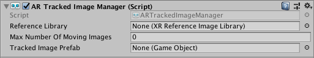

# AR Tracked Image Manager

The tracked image manager is a type of [trackable manager](trackable-managers.md).

The tracked image manager will create `GameObject`s for each detected image in the environment. Before an image can be detected, the manager must be instructed to look for a set of reference images compiled into a reference image library. Only images in this library will be detected.

## Reference Library

Refer to the documentation for the [Tracked Image Subsystem](http://docs.unity3d.com/Packages/com.unity.xr.arsubsystems@latest?preview=1&subfolder=/manual/image-tracking.html) for instructions for creating a reference image library.

The reference image library can be set at runtime, but as long as the tracked image manager component is enabled, the reference image library must be non-null.

The reference image library is an instance of the `ScriptableObject` `XRReferenceImageLibrary`. This object contains mostly Editor data. The actual library data (containing the image data) is provider-specific. Refer to your provider's documentation for details.

## Max Number of Moving Images

Some providers can track moving images. This typically requires more CPU resources, so you can specify the number of moving images to track simultaneously. Check for support via the `SubsystemDescriptor` (`ARTrackedImageManager.descriptor`).

## Tracked Image Prefab

This prefab will be instantiated whenever an image from the reference image library is detected. The manager ensures the instantiated `GameObject` includes an `ARTrackedImage` component. You can get the reference image that was used to detect the `ARTrackedImage` with the `ARTrackedImage.referenceImage` property.
