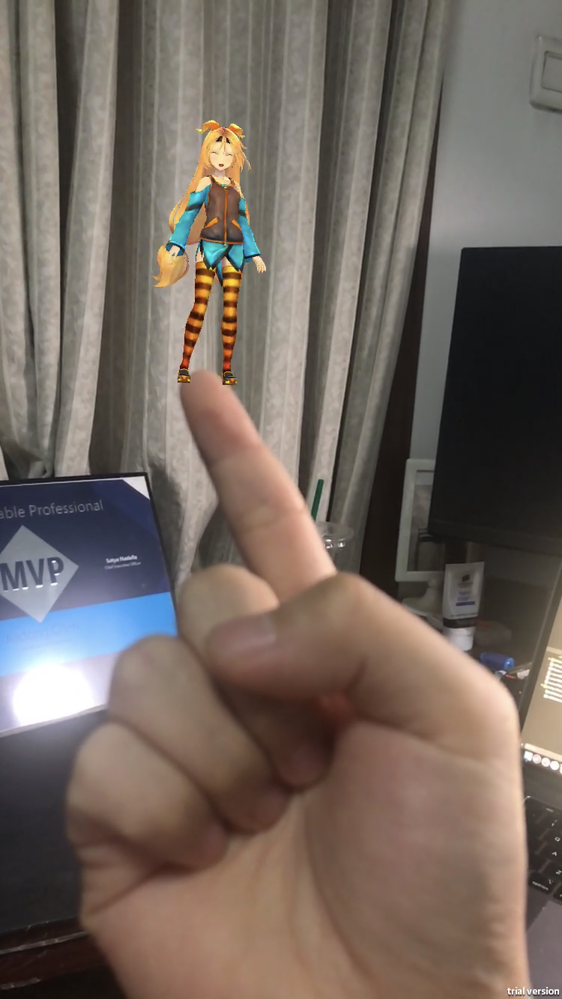

# Unity-ARFoundation-HandDetection


## Note

The project used in [this article](https://medium.com/chenjd-xyz/unity-ar-foundation-and-coreml-hand-detection-and-tracking-b74c592206c5) is on the `ForHandDetectionAndTrackingArticle` branch. 

The `master` branch is currently used for development and does not guarantee stability.

## Update

Add `GetNativeTexture` scene to the master branch to show how to get native texture from iOS to Unity context and use this texture to implement the hand pixelate effect.

There is a video:

[Unity AR Foundation Hand Detection 4
](https://www.youtube.com/watch?v=l0ZY2YEu7Ts)

## Description

This demo project shows how to enable the CoreML to work with [AR Foundation](https://docs.unity3d.com/Packages/com.unity.xr.arfoundation@1.5/manual/index.html) in Unity.

It is based on the [repo](https://github.com/giln/ARML) implemented on the native iOS platform by Gil Nakache.

The ARFoundation Plugin's version is 1.5.0-preview.5, you can find it inside the ARPackages folder.

For hand detection, the plugin uses the HandModel machine learning model. This model is from the same repo mentioned above inside the CoreML folder.


## Version

Unity Version: 2018.3.13f1

Xcode Version: 10.2.1

iPhone 7: 12.3.1

## Implemention

#### Import ARFoundation Plugin

For convenience, I use the local package import. This is very simple, just modify the manifest.json file in the package folder and add the local package in the project manifest.

```
    "com.unity.xr.arfoundation": "file:../ARPackages/com.unity.xr.arfoundation",
    "com.unity.xr.arkit": "file:../ARPackages/com.unity.xr.arkit

```

#### Create a Swift plugin for Unity

In order for C# to communicate with Swift, you need to create an object-c file as a bridge.

There is a [sample](https://github.com/chenjd/Unity-Hello-Swift). This proj demonstrates how to create a Swift plugin for Unity and print "Hello, I'm Swift" in Unity.

In the Unity-ARFoundation-HandDetection Proj, the structure of the plugins folder is as follows:

```none
<Plugins>
  └── iOS
      ├── HandDetector
      │   ├── Native
      │   │  ├──HandDetector.swift
      │   │  └──HandDetectorBridge.mm
      │   └── Managed
      │      └──HandDetector.cs
      └── Unity
```

## Read More
[Unity AR Foundation and CoreML: Hand detection and tracking
](http://www.jiadongchen.com/2019/07/unity-ar-foundation-and-coreml-hand-detection-and-tracking/)

I've written an article to describ the process for integrating CoreML and AR Foundation to detect and track the hand.



## License
Licensed under Apache 2.0.

Unity Native Plugin API headers licensed under Unity Companion License, please see the header contents for details.

Unity-Chan is provided under the Unity-Chan License 2.0 terms.
Please refer to the following link for information regarding the Unity-Chan License.

http://unity-chan.com/contents/guideline_en/


